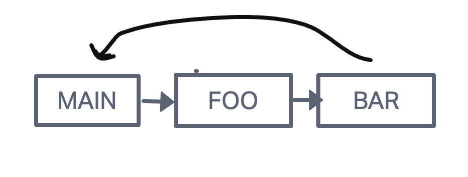

# Class 10 Notes

## Understaing the Javascript Call Stack

What is a ‘call’?

- Is the process of invoking a function.

How many ‘calls’ can happen at once?

- It is limited to the size of the call stack and the available memory of the system.

What does LIFO mean?

- Stands for 'Last In, First Out'. Describes the order which items are added and removed from stack data structure.

Draw an example of a call stack and the functions that would need to be invoked to generate that call stack.

- 

What causes a Stack Overflow?

- Occurs when the call stack exceeds its memory limit.

## Javascript Error Messages

What is a ‘reference error’?

- Occurs when you try to access a variable or function that doesnt exist.

What is a ‘syntax error’?

- Occurs when the code you've written does not follow the syntax rules of programming language.

What is a ‘range error’?

- Occurs when you try to use a value that is not within the allowable range.

What is a ‘type error’?

- Occurs when you try to perform an operation on a value of an incorrect data type.

What is a breakpoint?

- Is a debugging feature that allows you to pause the execution of your code at a specific line or statement.

What does the word ‘debugger’ do in your code?

- It acts like a breakpoint combing through the code to see if there is anything it can fix.
