# Prep: Introduction to SQL

Relational databases and SQL are foundational technologies for managing structured data. They provide a robust framework for organizing and querying data, making them essential tools for businesses and applications that require structured data storage and retrieval.

## Screenshots of SQL

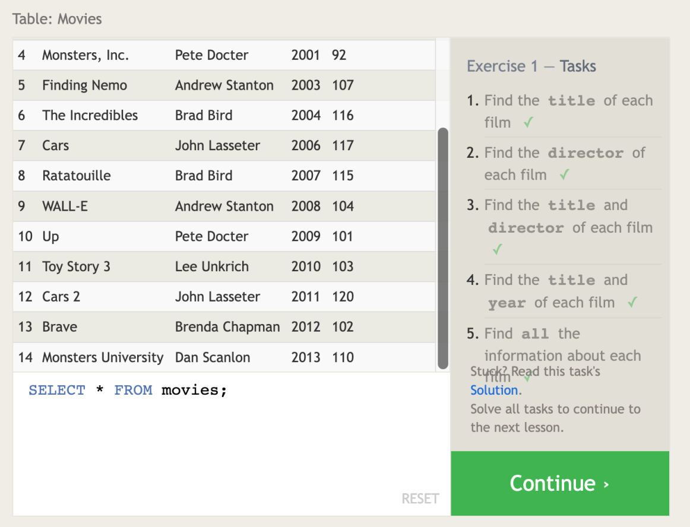

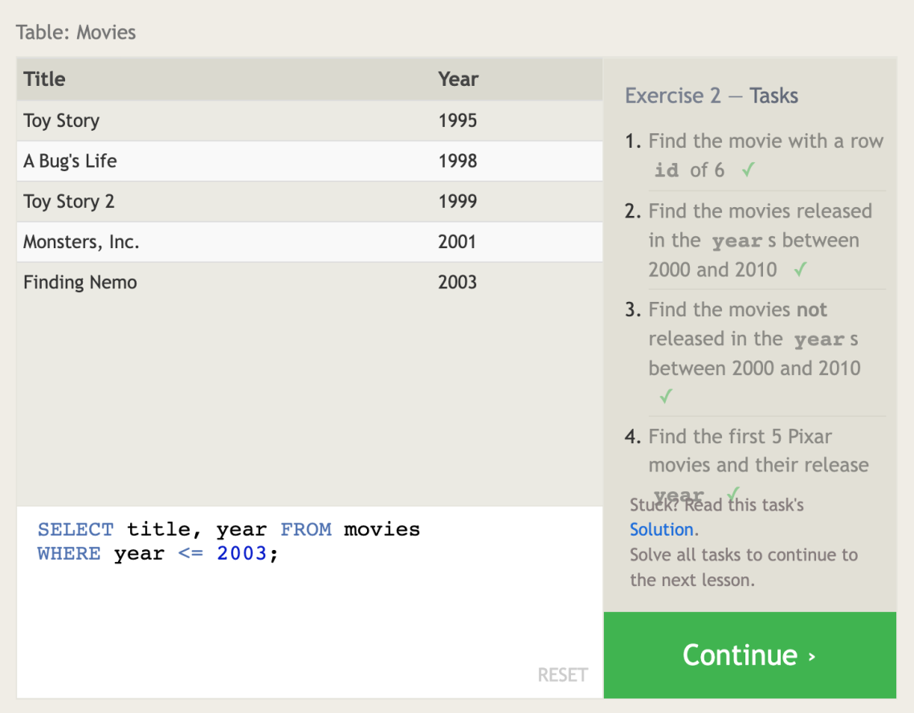

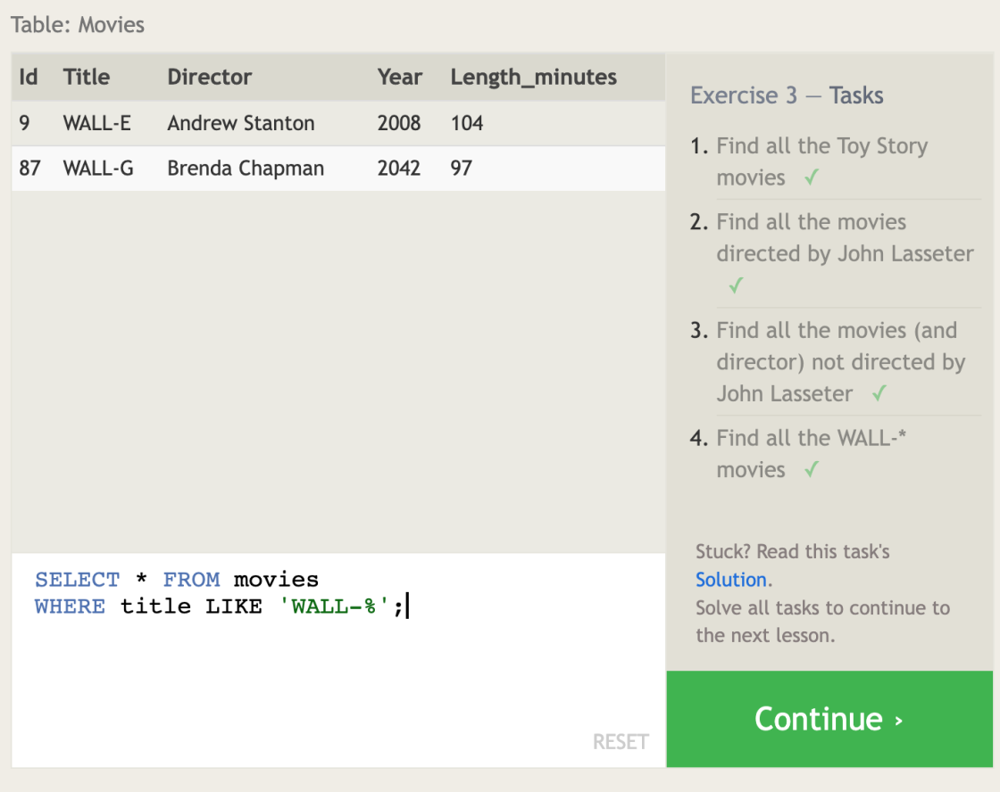

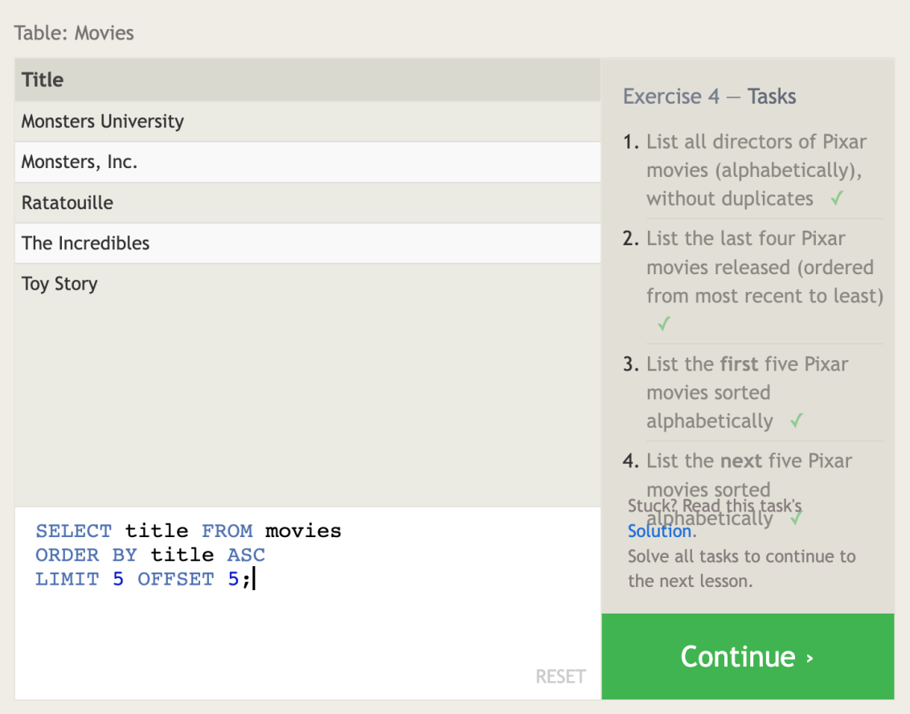

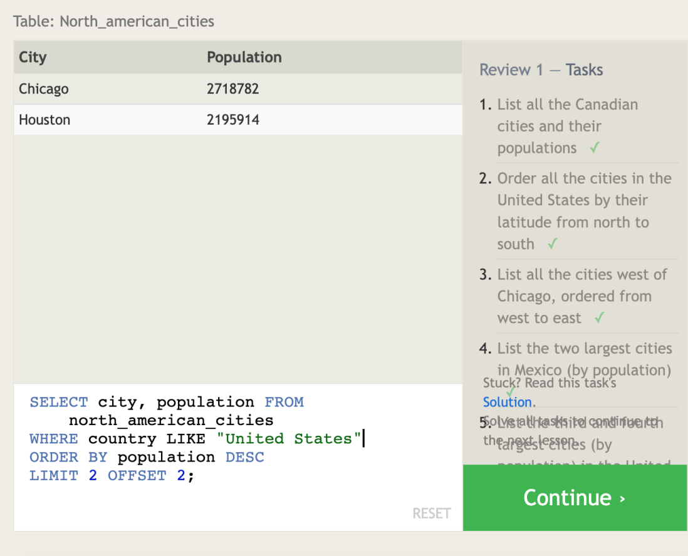

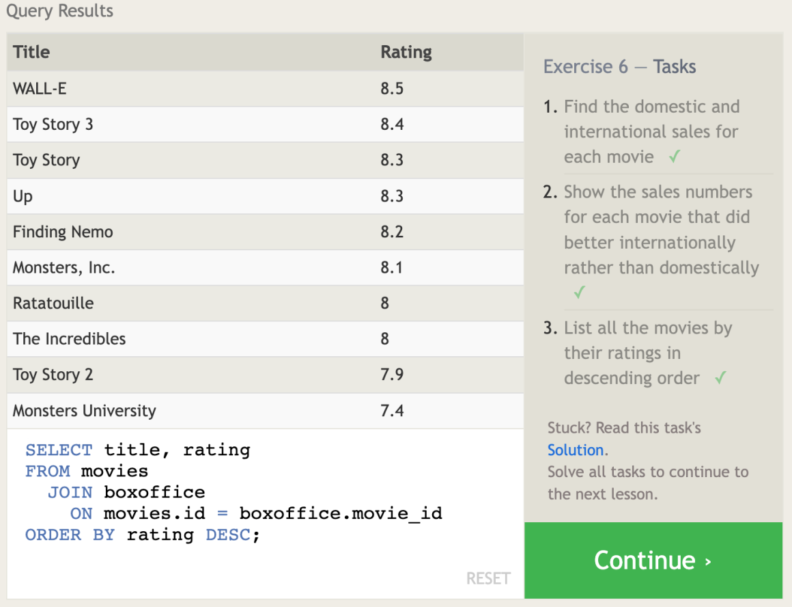

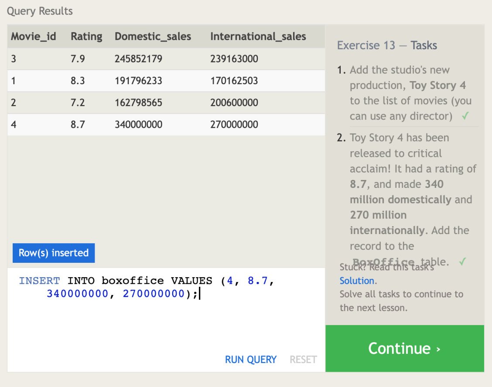

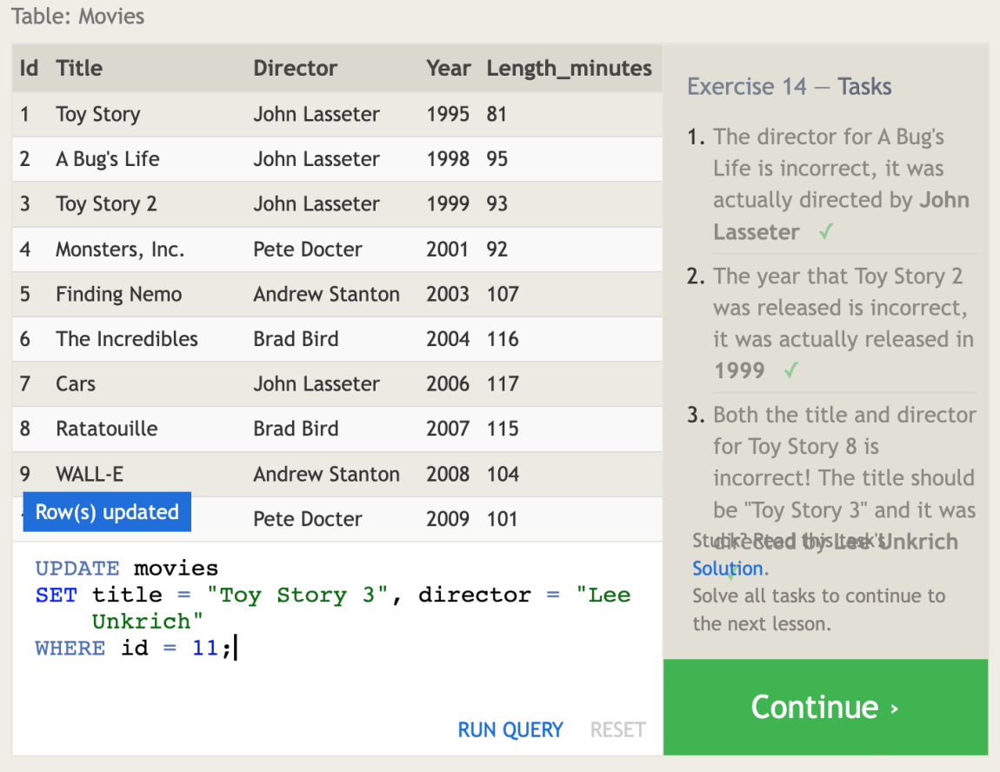

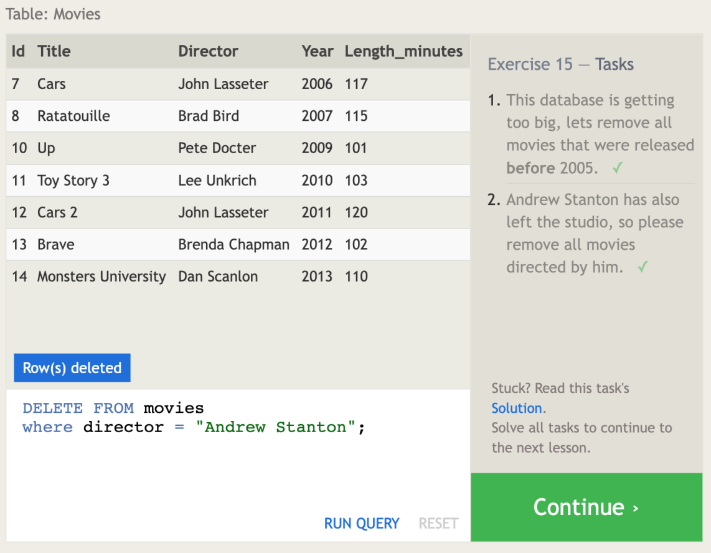

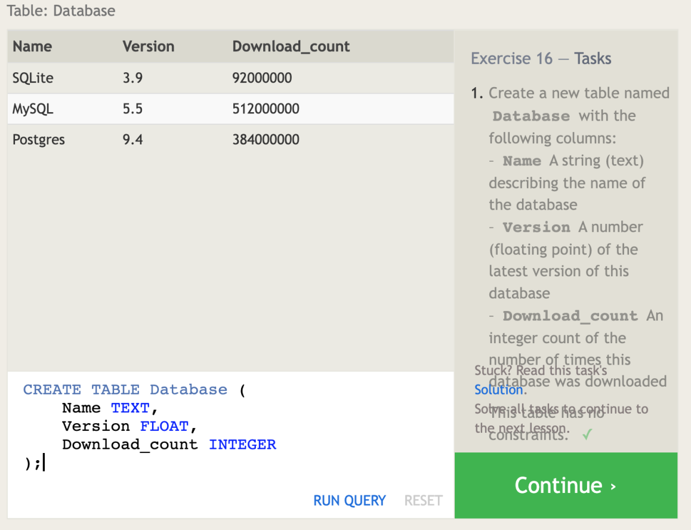

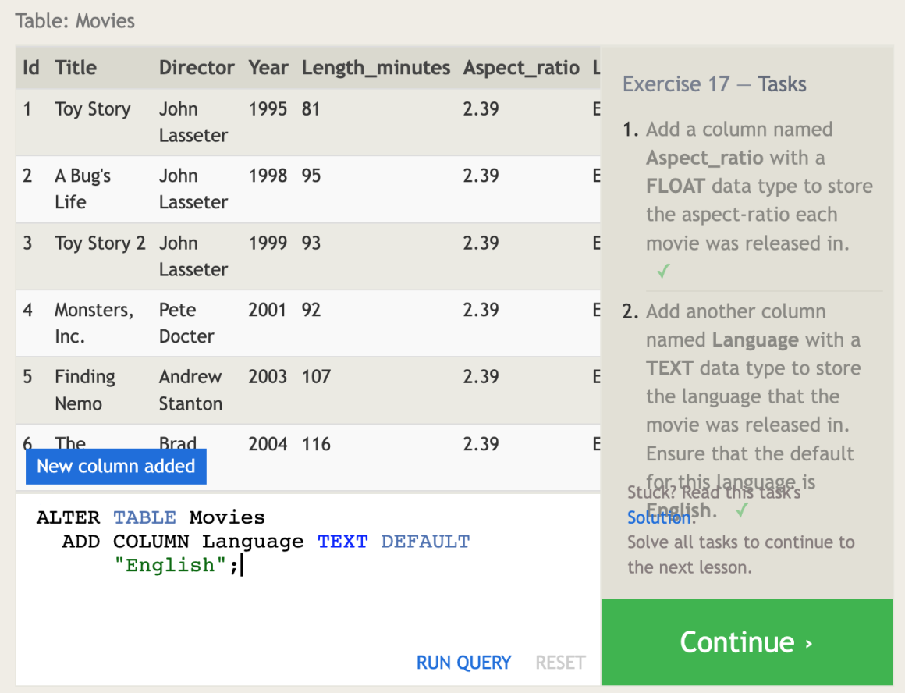

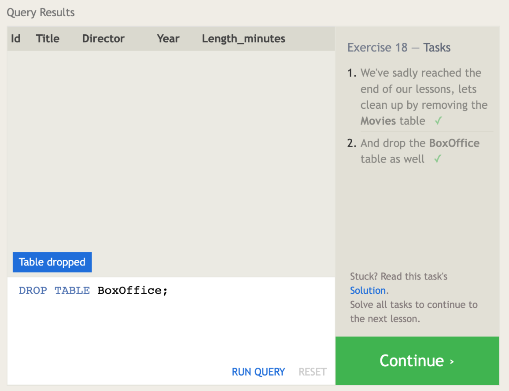

